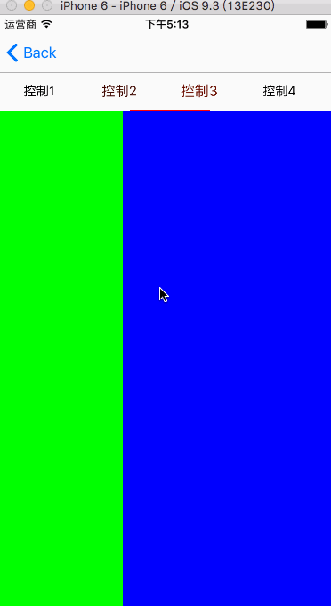
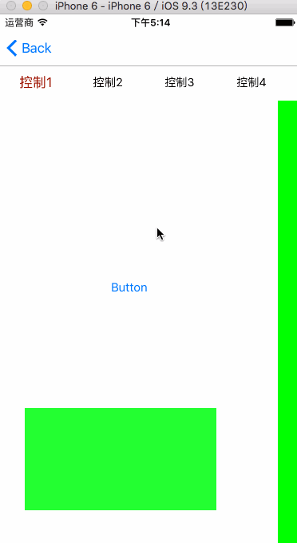

# ASPageViewController-OC
封装了一个OC版本的ASPageViewController用来实现手势滑动翻页和点击滑动翻页的功能

<html>
<body>

<h2>什么是ASPageViewController</h2>

我们在日常的app中经常会用到实现手势滑动翻页和点击翻页来实现对试图控制器控制的功能，趁着最近不忙，封装了一个实现这种功能的库分享给大家，希望大家能够喜欢，同时也希望大家能够提出宝贵的意见，谢谢！

<h2>支持pod导入</h2>

pod 'ASPageViewController', '~> 1.0.0'

github链接：https://github.com/zhanghongdou/ASPageViewController.git

随后为大家分享swift3.0封装的此库，希望大家能够多提宝贵的意见，谢谢

<h2>ASPageViewController和WMPageController的比较</h2>

WMPageController使用的是UIScrollView实现的这个功能，避免不了的，造成代码过多，本小编封装的ASPageViewController是借助UIPageViewController实现的，代码估计只有前者的三分之一吧，这也是本小编感觉比较荣幸的，但是还是很佩服WMPageController的作者的封装，本小编也在其中学到了不少的知识点，在这里也感谢WMPageController的作者，还有一点就是WMPageController可以实现添加作为导航栏的titleView，本小编封装的ASPageViewController暂为实现这个点，本小编在后续工程中会不断完善，谢谢大家的支持，下面给大家献上具体的接口和gif效果图

<h3>效果图1（带有下划线的样式）</h3>

<h3>效果图2（无下划线的样式）</h3>

<h2>调用接口</h2>

//实例化
    ASPageViewController *vc = [[ASPageViewController alloc]initWithViewControllerClasses:@[[A1ViewController class], [A2ViewController class], [A3ViewController class], [A4ViewController class], [A5ViewController class]] andTitles:@[@"控制1",@"控制2",@"控制3",@"控制4",@"控制5"]]; 
    //设置每一个item的宽度 
    vc.itemWidth = 90; 
    //设置样式（有下划线） 
    vc.style = ASTopViewStyleLine; 
    //（无下划线） 
//    vc.style = ASTopViewStyleNOLine; 
    //设置两边空出的宽度 
//    vc.sideBothWidth = 20; 
    //设置正常的字体颜色 
//    vc.normalTitleColor = [UIColor orangeColor]; 
    //设置选中的时候的字体颜色 
//    vc.selectTitleColor = [UIColor blueColor]; 
    //设置上部item的背景色 
//    vc.topViewBackGroundColor = [UIColor yellowColor]; 
    //设置下划线的颜色 
//    vc.lineColor = [UIColor blueColor]; 
    //设置所有item的宽度数组 
//    vc.itemWidthArray = @[@(150),@(80),@(70),@(90),@(150)];
 
</body>

</html>